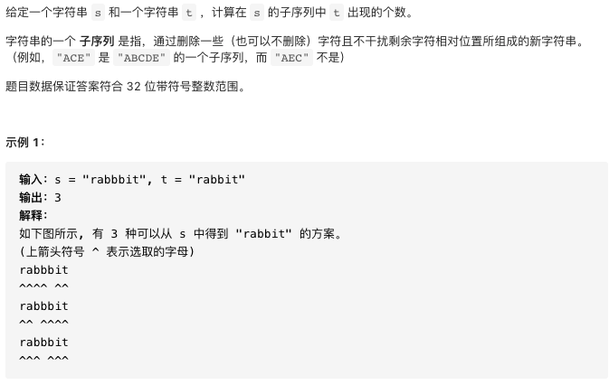
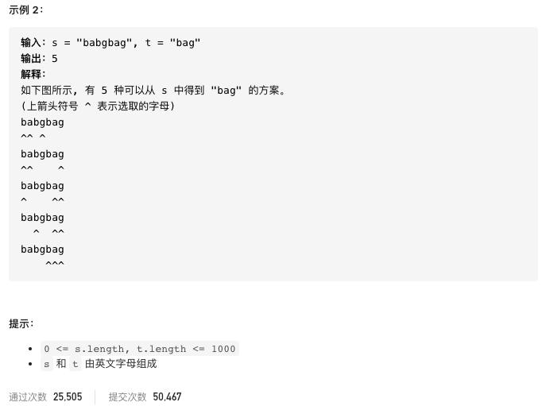

# 115.不同的子序列

https://leetcode-cn.com/problems/distinct-subsequences/


### 题目说明






### 解答

**思路**：

用dpi,j表示从0到j的串s中包含从0到i的串t的个数

在字符串前增加空串，s为空时，所有都为0，t为空时，是任何s的子串，都为1

一般情况

s[j]与t[i]的位置字符的情况有以下分类

s[j] == t[i]时，因为位置相等，可以由dp[i - 1] [j - 1]推得；也可以考虑不加入j位置的元素，可以由dp[i - 1] [j]推得，结果 = dp[i - 1] [j - 1] + dp[i] [j - 1]

s[j] != t[i]时，我们必须删除j位置的元素，结果 = dp[i] [j - 1]


### 方法1 

时间复杂度 O(mn) 空间复杂度O(mn)

```java
class Solution {
    public int numDistinct(String s, String t) {
        // t用i表示，s用j表示
        // dp表示s 0-j长度 中 t 0-i 的子串的个数
        int[][] dp = new int[t.length() + 1][s.length() + 1];
        // 初始化“”字符串的情况
        // t为“”时
        // 此时必须把s删除为空串，对应只有一个t的子串
        for(int j = 0; j < s.length() + 1; j++) dp[0][j] = 1;
        for(int i = 1; i < t.length() + 1; i++) {
            for(int j = 1; j < s.length() + 1; j++) {
                // 实际判断位置为减一
                if(t.charAt(i - 1) == s.charAt(j - 1))
                // 代表加入i，j位置字符的长度 和 删除s中j位置字符的长度，两种情况
                    dp[i][j] = dp[i - 1][j - 1] + dp[i][j - 1];
                // 因为不相等，所以可以选择删除j位置字符，由前面状态推得
                else dp[i][j] = dp[i][j - 1];
            }
        }
        return dp[t.length()][s.length()];
    }
}

```


