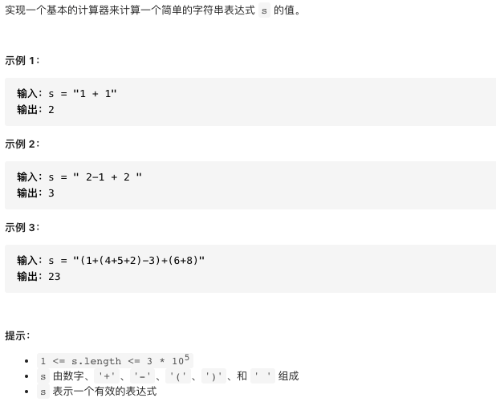

# 224.简单计算器

https://leetcode-cn.com/problems/substring-with-concatenation-of-all-words/


### 题目说明




### 解答

**思路**：

字符串只有数字括号和加好减号两种运算符，因此可以展开括号，只有数字的符号会发生变化。

我们使用栈来存储当前位置的符号，使用（+1，-1）表示。

维护一个栈，代表当前位置所处的每个括号所共同形成的符号

### 方法1 括号展开 + 栈

例子：以1+2+（3-（4+5））

扫描到1+2，当前位置未被括号包括，栈顶元素初始值为+1

扫描到1+2+（3，当前位置被一个括号包含，括号前面为+，因此栈顶元素依然为+1；

扫描到1+2+（3-（4时，当前位置被两个括号包含，分别对应着+号和符号，合并结果为-，因此栈顶元素变为-1

想办法维持以上状态即可

得到栈ops后，sign的取值就能确定了，遇到+号，sign <- ops.top，如果遇到-号，sign<- -ops.top()

```java
class Solution {
  public int calculate(String s) {
    Dequeue<Integer> ops = new LinkedList<>();
    // 初始栈顶元素为1，当前符号为1
    ops.push(1);
    int sign = 1;
    
    int ret = 0;
    int n = s.length();
    int i = 0;
    while(i < n) {
      // 跳过空格
      if(s.charAt(i) == ' ') i++;
      else if(s.charAt(i) == '+'){
        // 获得当前括号的影响，其实就是括号前面运算符的作用
        sign = ops.peek();
        i++;
      } else if(s.charAt(i) == '-') {
        sign = -ops.peek();
        i++;
      } else if(s.charAt(i) == '(') {
        // 进入新的括号，将当前sign作为影响放入栈
        ops.push(sign);
        i++;
      } else if(s.charAt(i) == ')') {
				// 当前括号，影响结束
        ops.pop();
        i++;
      } else {
        // 数字计算，可能是多位
        long num = 0;
        while(i < n && Character.isDigit(s.charAt(i))) {
          num = num * 10 + s.charAt(i) - '0';
          i++;
        }
        ret += sign * num;
      }
    }
  }
}
```


# 补充

### 中缀表达式转后缀表达式 （负数的问题？）

1. 数字直接输出
2. 符号 优先级更高的更优先出栈
   1. 优先级大于栈顶元素，入栈
   2. 优先级小于等于栈顶元素，持续出栈直到优先级大于栈顶元素或者栈为空
   3. 左括号直接入栈
   4. 遇到右括号，将栈内元素持续出栈，直到找到左括号，将左括号出栈
3. 扫描结束，将栈内元素全部出栈

### 后缀表达式计算

从左向右遍历，遇到数字出栈

遇到符号将a，b出栈，后出栈元素 在前 计算结果，并将结果入栈

```java
class Solution {
    public int calculate(String s) {
//        String s1 = inToPost(s);
//        System.out.println(s1);
        return calPost(inToPost(s));
    }
    private String inToPost(String s) {
        Stack<Character> stack = new Stack<>();
        char[] chars = s.toCharArray();
        int i = 0;
        StringBuilder temp = new StringBuilder();
        while (i < chars.length) {
            // 字符为运算符的情况
            if(chars[i] < '0' || chars[i] > '9') {
                switch (chars[i]) {
                    case ')': {
                        // 出栈直到找到左括号
                        while (stack.peek() != '(') temp.append(stack.pop()).append(",");
                        // 出栈左括号
                        stack.pop();
                        break;
                    }
                    case '*': {
                        // 将乘除号出栈，相同优先级下，左侧先计算
                        while (!stack.isEmpty() && (stack.peek() == '*' || stack.peek() == '/')) temp.append(stack.pop()).append(",");
                        // 入栈
                        stack.push('*');
                        break;
                    }
                    case '/': {
                        // 将乘除号出栈，相同优先级下，左侧先计算
                        while (!stack.isEmpty() && (stack.peek() == '*' || stack.peek() == '/')) temp.append(stack.pop()).append(",");
                        // 入栈
                        stack.push('/');
                        break;
                    }
                    case '+': {
                        while (!stack.isEmpty() && (stack.peek() == '*' || stack.peek() == '/' || stack.peek() == '-' || stack.peek() == '+')) temp.append(stack.pop()).append(",");
                        // 入栈
                        stack.push('+');
                        break;
                    }
                    case '-': {
                        // 负数，i前面是第一个或者+ - * / 或者 (
                        if(i == 0 || chars[i -1] == '+' || chars[i -1] == '-' || chars[i -1] == '*' || chars[i -1] == '/' || chars[i -1] == '(') {
                            temp.append("0").append(",");
                        }
                        while (!stack.isEmpty() && (stack.peek() == '*' || stack.peek() == '/' || stack.peek() == '-' || stack.peek() == '+')) temp.append(stack.pop()).append(",");
                            // 入栈
                        stack.push('-');
                        break;
                    }
                    case '(': {
                        stack.push('(');
                        break;
                    }
                }
            }
            else {
                // 字符为数字
                int j = i + 1;
                while (j < chars.length && chars[j] >= '0' && chars[j] <= '9') j++;
                temp.append(chars, i, j - i).append(",");
                i = j - 1;
            }
            i++;
        }
        while (!stack.isEmpty()) temp.append(stack.pop());
        return temp.toString();
    }
    private int calPost(String s) {
        String[] split = s.split(",");
        Stack<Integer> stack = new Stack<>();
        for(String each : split) {
            if(each.equals("+") || each.equals("-") || each.equals("*") || each.equals("/")) {
                int a = stack.pop();
                int b = stack.pop();
                switch (each) {
                    case "+": {
                        stack.push(b + a);
                        break;
                    }
                    case "-": {
                        stack.push(b - a);
                        break;
                    }
                    case "*": {
                        stack.push(b * a);
                    }
                    case "/": {
                        stack.push(b / a);
                        break;
                    }
                }
            } else stack.push(Integer.valueOf(each));
        }
        return stack.pop();
    }
}
```

