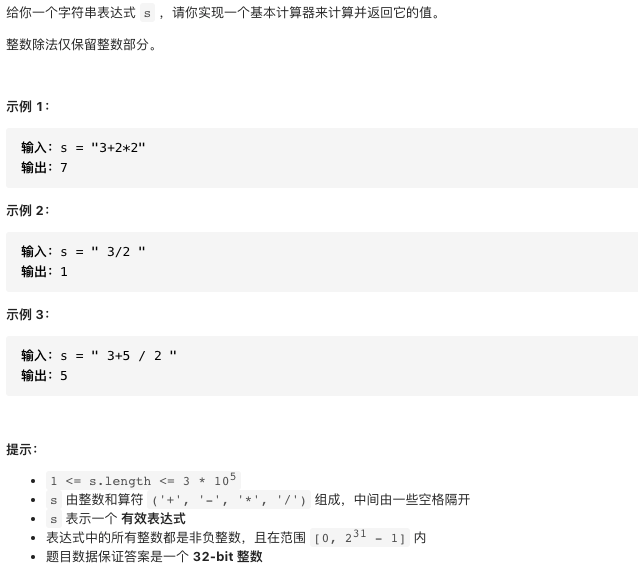

# 227.基本计算器

https://leetcode-cn.com/problems/basic-calculator-ii/


### 题目说明




### 解答

**思路**：

利用栈，先计算乘除法，遇到加减法入栈，减法入栈相反数，最后将栈内所有元素相加

当前遍历到运算符时，计算前一个运算符的结果。数字长度不确定，只有当前遍历到运算符或到末尾时，才能确定数字已经结束

### 方法1 

```java
class Solution {
    public int calculate(String s) {
        Deque<Integer> stack = new LinkedList<Integer>();
        char preSign = '+';
        int num = 0;
        int n = s.length();
        for (int i = 0; i < n; ++i) {
            if (Character.isDigit(s.charAt(i))) {
                num = num * 10 + s.charAt(i) - '0';
            }
            if (!Character.isDigit(s.charAt(i)) && s.charAt(i) != ' ' || i == n - 1) {
                switch (preSign) {
                    case '+':
                        stack.push(num);
                        break;
                    case '-':
                        stack.push(-num);
                        break;
                    case '*':
                        stack.push(stack.pop() * num);
                        break;
                    default:
                        stack.push(stack.pop() / num);
                }
                preSign = s.charAt(i);
                num = 0;
            }
        }
        int ans = 0;
        while (!stack.isEmpty()) {
            ans += stack.pop();
        }
        return ans;
    }
}
```


