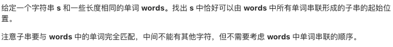
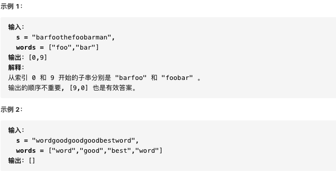

# 30.串联所有单词的子串

https://leetcode-cn.com/problems/substring-with-concatenation-of-all-words/

### 题目说明





### 解答

**思路**：将words所有单词及其个数存入一个hashmap，然后看s中与words等长的一段子串是否与hashmap完全匹配

### 方法1 

时间复杂度 O(n2) 空间复杂度O(n)

直接遍历s，将每个长度为word的子字符串存入hashmap，最后比较hashmap是否相等

```java
class Solution {
    public List<Integer> findSubstring(String s, String[] words) {
        List<Integer> res = new ArrayList<>();
        if (s == null || s.length() == 0 || words == null || words.length == 0) return res;
        HashMap<String, Integer> map = new HashMap<>();
        int one_word = words[0].length();
        int word_num = words.length;
        int all_len = one_word * word_num;
        for (String word : words) {
            map.put(word, map.getOrDefault(word, 0) + 1);
        }
      // 遍历每个开始的位置，以all_len为长度
        for (int i = 0; i < s.length() - all_len + 1; i++) {
            String tmp = s.substring(i, i + all_len);
            HashMap<String, Integer> tmp_map = new HashMap<>();
            for (int j = 0; j < all_len; j += one_word) {
                String w = tmp.substring(j, j + one_word);
                tmp_map.put(w, tmp_map.getOrDefault(w, 0) + 1);
            }
            if (map.equals(tmp_map)) res.add(i);
        }
        return res;
    }
}
```

### 方法2 滑动窗口

时间复杂度O(n)

与方法1的区别在于处理s的不同。

从0, 1, one_word -1 开始遍历s，指针每次滑动一个one_word长度。使用一个count计数，当范围内个数恰好等于words的个数时，代表得到了一个答案。

```java
public class Solution2 {
    public List<Integer> findSubstring(String s, String[] words) {
        List<Integer> res = new ArrayList<>();
        if(s == null || s.length() == 0 || words == null || words.length == 0) return res;
        Map<String, Integer> map = new HashMap<>();
        int one_word = words[0].length();
        int word_num = words.length;
        for(String word : words) {
            map.put(word, map.getOrDefault(word, 0) + 1);
        }
        // 只讨论从 0, 1 ... one_word - 1 开始的情况的情况
        for(int i = 0; i < one_word; i++) {
            int left = i, right = i, count = 0;
            Map<String, Integer> tmp_map = new HashMap<>();
          // 注意右指针的边界条件
            while (right + one_word <= s.length()) {
                String w = s.substring(right, right + one_word);
                tmp_map.put(w, tmp_map.getOrDefault(w, 0) + 1);
                // 向右滑动
                right += one_word;
                count++;
                // 此单词个数大于 words里的个数
                // left向右划减少个数
                while (tmp_map.getOrDefault(w, 0) > map.getOrDefault(w, 0)) {
                    String t_w = s.substring(left, left + one_word);
                    count--;
                    tmp_map.put(t_w, tmp_map.getOrDefault(t_w, 0) - 1);
                    left += one_word;
                }
                // 获得一种可能的情况
                if(count == word_num) res.add(left);
            }
        }
        return res;
    }
}
```


