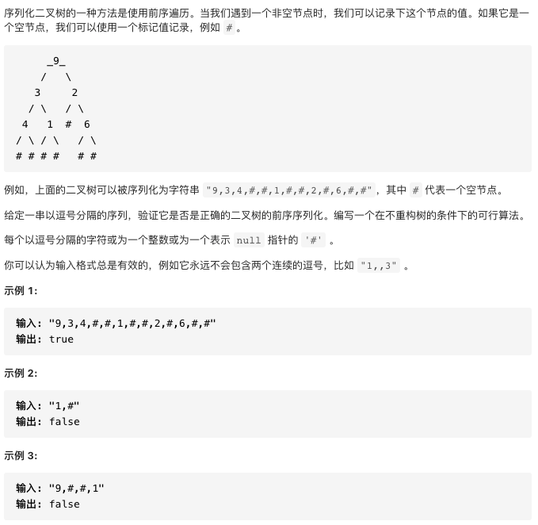

# 331.验证二叉树的前序序列化

https://leetcode-cn.com/problems/verify-preorder-serialization-of-a-binary-tree/


### 题目说明




### 解答

**思路**：

槽位，可以看做当前二叉树正在等待被节点填充的位置。

遇到节点时：如果遇到空节点则消耗一个槽位。

遇到非空节点：则除了消耗一个槽位外，还需要补充两个槽位。

默认槽位为1，即加入根节点之前。

### 方法1 

时间复杂度 O(n) 空间复杂度O(n)

栈中每个元素，代表了对应节点处剩余槽位位置，而栈顶元素对应着下一步可用的槽位位置。遇到空节点，仅将栈顶元素减1；遇到非空节点栈顶元素减1后，在向栈中压入一个2。当栈顶元素变为0,将栈顶弹出。

```java
class Solution {
    public boolean isValidSerialization(String preorder) {
        int n = preorder.length();
        int i = 0;
        Deque<Integer> stack = new LinkedList<Integer>();
        stack.push(1);
        while (i < n) {
            if (stack.isEmpty()) {
                return false;
            }
            if (preorder.charAt(i) == ',') {
                i++;
            } else if (preorder.charAt(i) == '#'){
                int top = stack.pop() - 1;
                if (top > 0) {
                    stack.push(top);
                }
                i++;
            } else {
                // 读一个数字
                while (i < n && preorder.charAt(i) != ',') {
                    i++;
                }
                int top = stack.pop() - 1;
                if (top > 0) {
                    stack.push(top);
                }
                stack.push(2);
            }
        }
        return stack.isEmpty();
    }
}
```


### 方法2 空间优化

时间复杂度 O(n) 空间复杂度O(1)

将所有槽位作为一个

```java
class Solution {
    public boolean isValidSerialization(String preorder) {
        int n = preorder.length();
        int i = 0;
        int slots = 1;
        while (i < n) {
            if (slots == 0) {
                return false;
            }
            if (preorder.charAt(i) == ',') {
                i++;
            } else if (preorder.charAt(i) == '#'){
                slots--;
                i++;
            } else {
                // 读一个数字
                while (i < n && preorder.charAt(i) != ',') {
                    i++;
                }
                slots++; // slots = slots - 1 + 2
            }
        }
        return slots == 0;
    }
}
```


