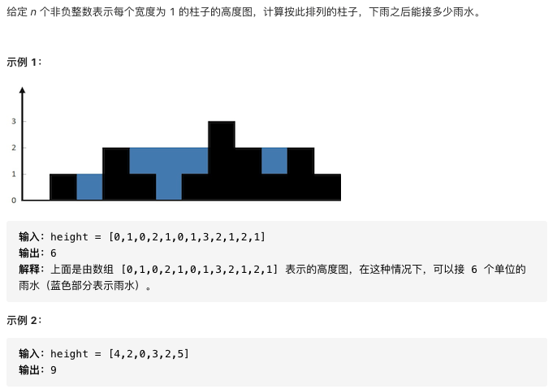
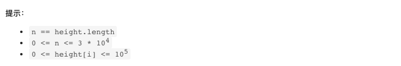

# 42.接雨水

https://leetcode-cn.com/problems/trapping-rain-water/


### 题目说明






### 解答

**思路**：

双指针，实际四个指针

left，right不断移动，left_max记录此时没有计算的左边界的最大值，right_max记录右边

不断移动left，对雨水求和，当left大于left_max，更新left_max为left


### 方法1 双指针

时间复杂度 O(n) 空间复杂度O(1)

```java
class Solution {
  public int trap(int[] height) {
    int left = 0;
    int right = height.length - 1;
    int ans = 0;
    // 记录最大值
    int left_max = 0;
    int right_max = 0;
    while(left < right) {
      if(height[left] < height[right]) {
        if(height[left] >= left_max) {
          // 更新左边界最大值
          left_max = height[left];
        } else {
          // 计算雨水
          ans += (left_max - height[left]);
        }
        ++left;
      } else {
        if(height[right] >= right_max) {
          right_max = height[right];
        } else {
          ans += (right_max - height[right])
        }
        right--;
      }
    }
  }
}
```


