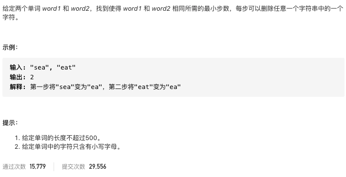

# 583.两个字符串的删除操作

https://leetcode-cn.com/problems/delete-operation-for-two-strings/


### 题目说明




### 解答

**思路**：

求最长公共子序列，然后用m + n - 2 * LCS

### 方法1 求最长公共子序列 

```java
class Solution {
    public int minDistance(String word1, String word2) {
      int m = word1.length();
      int n = word2.length();
      int[][] dp = new int[m + 1][n + 1];
      for(int i = 0; i <= m; i++) {
        for(int j = 0; j <= n; j++) {
          if(i == 0 || j == 0) continue;
          if(word1.charAt(i - 1) == word2.charAt(j - 1)) {
            // ij位置的字符纳入考虑
            dp[i][j] = dp[i - 1][j - 1] + 1;
          } else {
            // 保留1，2中更大的位置的字符
            dp[i][j] = Math.max(dp[i][j - 1], dp[i - 1][j]);
          }
        }
      }
      return m + n - 2 * dp[m][n];
    }
}
```


### 方法2 编辑距离，只带删除操作

```java
class Solution {
    public int minDistance(String word1, String word2) {
        if(word1 == null || word2 == null) return 0;
        int m = word1.length();
        int n = word2.length();
        int[][] dp = new int[m + 1][n + 1];
        for(int i = 0; i <= m; i++) {
            dp[i][0] = i;
        }
        for(int i = 0; i <= n; i++) {
            dp[0][i] = i;
        }
        for(int i = 1; i <= m; i++) {
            for(int j = 1; j <= n; j++) {
                if(word1.charAt(i - 1) == word2.charAt(j - 1)) {
                    dp[i][j] = dp[i - 1][j - 1];
                } else {
                    dp[i][j] = Math.min(dp[i - 1][j], dp[i][j - 1]) + 1;
                }
            }
        }
        return dp[m][n];
    }
}
```


