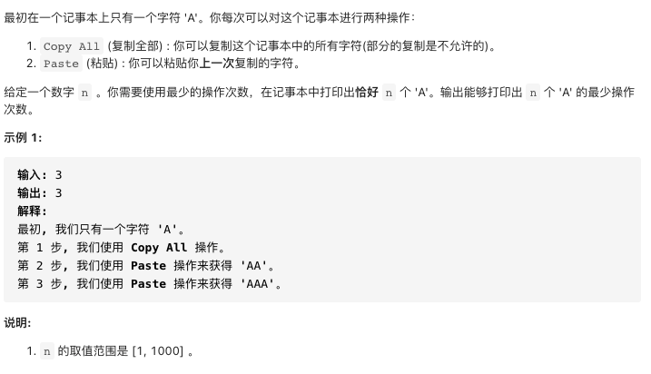

# 650.只有两个键的键盘

https://leetcode-cn.com/problems/2-keys-keyboard/


### 题目说明




### 解答

**思路**：

寻找n的最大因子k

n的次数等于最大因子的次数，复制一次，然后粘贴(i - k) / k 次

dp[i] = dp[k] + 1 + (i - k) / k


### 方法1 动态规划

时间复杂度 O(n) 空间复杂度O(n)

```java
class Solution {
  public int minSteps(int n) {
    // 获得i的最小次数
    int[] dp = new int[n + 1];
    for(int i = 1; i <= n; i++) {
      //寻找最大因子，
      for(int k = i / 2; k > 0; k--) {
        if(i % k == 0) {
          dp[i] = dp[k] + 1 + (i - k) / k;
          break;
        }
      }
    }
    return dp[n];
  }
}
```


