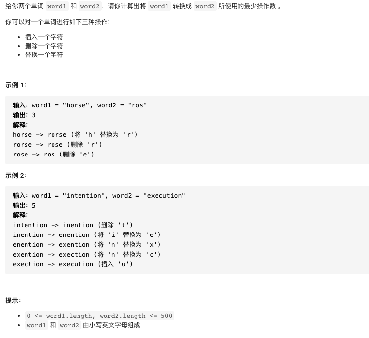
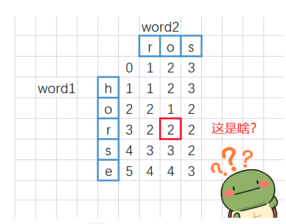

# 72.编辑距离

https://leetcode-cn.com/problems/edit-distance/


### 题目说明



### 解答

**思路**：

自顶向下的递归或自底向上的动态规划

动态规划，从0开始构建

opi,j表示word1 0-i 到word2 0-j 所需的最小步数

+ 如果word1[i] = word2[j] 那么所需要的步数就等于opi-1,j-1
+ 如果不等
  + 对word1进行插入操作 opi-1,j     + 1
  + 对word2进行插入操作opi,j - 1    + 1
  + 替换操作 opi-1,j-1  +1

初始情况，某一个为0时，操作次数即为另一个长度

相当于在前面添加空字符串



### 方法1 动态规划

```java
class Solution {
  public int minDistance(String word1, String word2) {
    if(word1.length() < 1) return word2.length();
    if(word2.length() < 1) return word1.length();
    // 相当于在前面添加了一个空字符串
    int[][] op = new int[word1.length() + 1][word2.length() + 1];
    for(int i = 0; i < op.length; i++) {
      op[i][0] = i;
    }
    for(int i = 0; i < op[0].length; i++) {
      op[0][i] = i;
    }
    for(int i = 1; i < op.length; i++) {
      for(int j = 1; j < op[i].length; j++) {
          // 实际判断的是i - 1的位置
        if(word1.charAt(i - 1) == word2.charAt(j - 1)) {
          op[i][j] = op[i - 1][j - 1];
        } else {
          op[i][j] = 1 + Math.min(op[i][j - 1], Math.min(op[i - 1][j], op[i - 1][j - 1]));
        }
      }
    }
    return op[word1.length()][word2.length()];
  }
}
```


