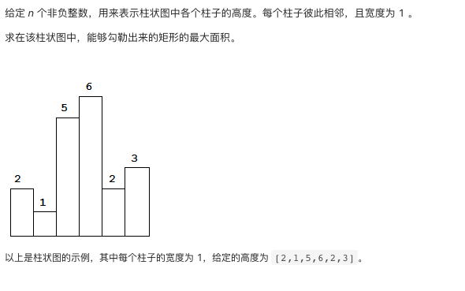
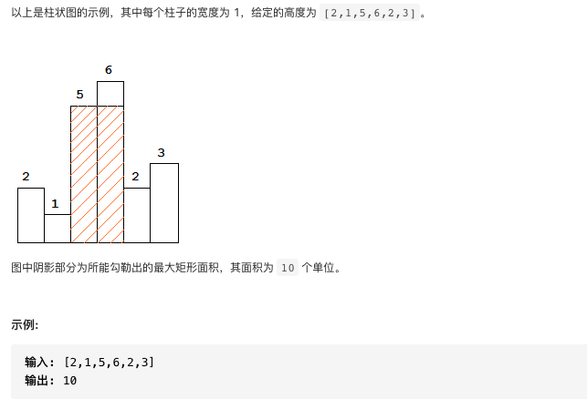

# 84.柱状图中的最大矩形

https://leetcode-cn.com/problems/largest-rectangle-in-histogram/


### 题目说明






### 解答

**思路**：

确定矩阵的高度，由该高度向两侧扩散，直到遇到比他矮的矩阵，此时计算一个矩阵面积。

优化方案，以空间换时间遍历中存储信息

### 方法1 暴力遍历

时间复杂度 O(n2) 空间复杂度O(1)

```java
class Solution {
    public int largestRectangleArea(int[] heights) {
        int maxArea = 0;
        for(int i = 0; i < heights.length; i++) {
            int left = i;
            while(left - 1 >= 0 && heights[left - 1] >= heights[i]) left--;
            int right = i;
            while(right + 1 < heights.length && heights[right + 1] >= heights[i]) right++;
            maxArea = Math.max(maxArea, (right - left + 1) * heights[i]);
        }
        return maxArea;
    }
}
```


### 方法2 单调栈

时间复杂度O(n) O(n)

维护一个单调递增的栈

当当前元素小于栈顶，代表找到了栈顶元素的右边界，弹出栈顶元素，此时新的栈顶元素即为左边界。

通过设置哨兵，简化代码情况

```java
class Solution {
    public int largestRectangleArea(int[] heights) {
        int len = heights.length;
        if(len < 1) return 0;
        if(len == 1) return heights[0];
        int area = 0;
        // 设立哨兵
        int[] newHeights = new int[len + 2];
        for(int i = 0; i < len; i++) {
            newHeights[i + 1] = heights[i];
        }
        len += 2;
        heights = newHeights;
        // 单调栈
        Deque<Integer> stack = new ArrayDeque<Integer>();
        stack.addLast(0);
        // 末尾哨兵的作用，会将栈中所有大于0的元素弹出
        for(int i = 1; i < len; i++) {
            // 栈顶元素大于当前元素，代表栈顶元素找到了右边界，而新的栈顶元素为左边界
            while(heights[stack.peekLast()] > heights[i]) {
                int height = heights[stack.removeLast()];
                // i 和 stack.peekLast()都不在范围内，所以这样计算
                int width = i - stack.peekLast() - 1;
                area = Math.max(area, width * height);
            }
            stack.addLast(i);
        }
        return area;
    }
}
```

