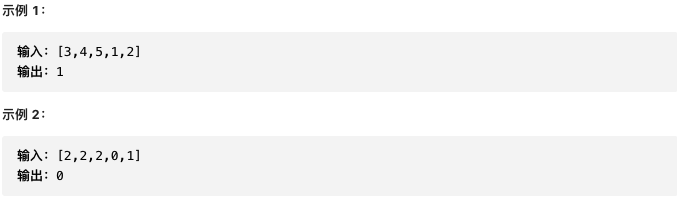
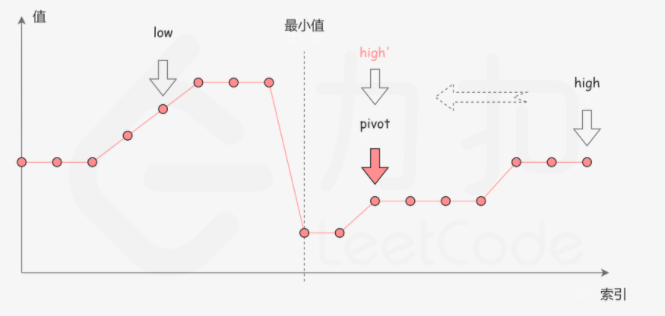
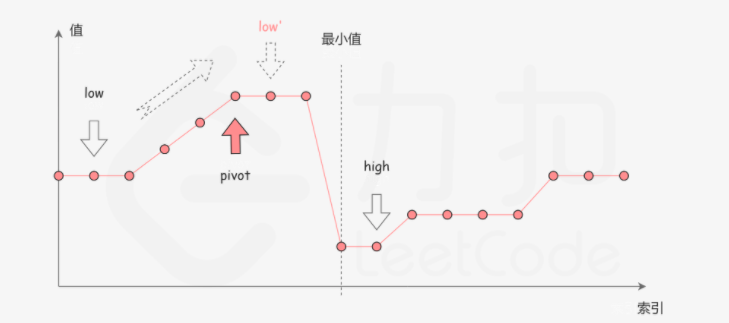
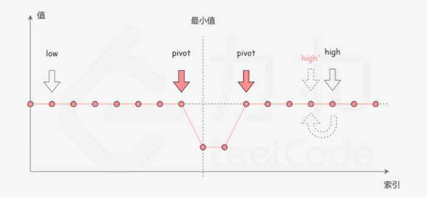

#  剑指offer11.旋转数组的最小数字

https://leetcode-cn.com/problems/xuan-zhuan-shu-zu-de-zui-xiao-shu-zi-lcof/


### 题目说明

把一个数组最开始的若干个元素搬到数组的末尾，我们称之为数组的旋转。输入一个递增排序的数组的一个旋转，输出旋转数组的最小元素。例如，数组 [3,4,5,1,2] 为 [1,2,3,4,5] 的一个旋转，该数组的最小值为1。




### 解答

**思路**：特殊的二分查找


### 方法1 不存在重复元素

时间复杂度 O(logn)

```java
class Solution {
    // 不存在重复元素
    public int minArray(int[] numbers) {
        if(numbers[0] < numbers[numbers.length - 1]) return numbers[0];
        int flag = numbers[0];
        int start = 0;
        int end = numbers.length - 1;
        // 区别于一般的二分，不存在return的情况，start == end 则代表找到了最小值
        while(start < end) {
            int mid = start + (end - start) / 2;
            if(numbers[mid] >= flag) start = mid + 1;
            else end = mid;
        }
        return numbers[start];
    }
}
```


### 方法2 存在重复元素

时间复杂度O(logn)

如图分为三种情况

**情况1**

numbers[mid] < numbers[high]，说明numbers[mid]是最小值右侧的元素，忽略右半部分



**情况2**

numbers[mid] > numbers[high]，说明numbers[mid]是最小值左边的元素，忽略左半部分



**情况3**

numbers[mid] == numbers[high]。由于重复元素存在，无法确定mid在最小值左侧还是右侧，无论numbers[high]是不是最小值，他都有一个替代品(与mid相等)，因此忽略右端点



```java
class Solution {
  public int minArray(int[] numbers) {
    int low = 0;
    int high = numbers.length - 1;
    while(low < high) {
      int mid = low + (high - low) / 2;
      // 注意右边变换为mid，答案出现在右侧，可能为mid
      if(numbers[mid] < numbers[high]) high = mid;
      // 这种情况一定不为mid
      else if(numbers[mid] > numbers[high]) low = mid + 1;
      else high -= 1;
    }
    return numbers[low];
  }
}
```


