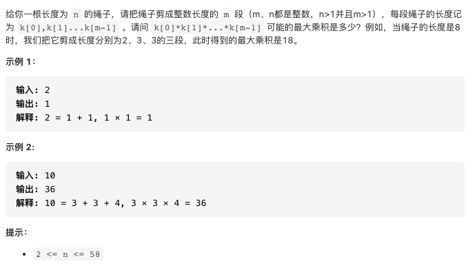

# 剑指offer14-1.剪绳子

https://leetcode-cn.com/problems/jian-sheng-zi-lcof/


### 题目说明




### 解答

**思路**：

存在数学推导的方法，核心思想是尽可能分成长度为3的小段，这样乘积最大

常规方法动态规划


### 方法1  动态规划

时间复杂度 O(n2) 空间复杂度O(n)

1. 求长度为n的绳子最大的乘积可以由前面比n小的绳子转移

2. dp数组表示长度为n的绳子所能剪出的最大值，dp[i]表示长度为i的绳子剪为m端后可以获得的最大值。注意数据范围n从2开始，初始化dp[2] = 1，m 和 n 都大于1，也就是说至少剪为2端

3. 将绳子减掉长度为j的第一段，如果减掉长度为1，对乘积无增益，所以从2开始减

4. 减掉第一段后，剩余长度为i - j ，可以选择剪，也可以选择不剪。不剪的话长度乘积为j * (i - j)；如果继续剪的话，可以由dp求得，j * dp[i - j]。最后取两者的最大值

5. 第一段可以取的区间为[2, j)，最终的状态转移方程为

   ```java
   dp[i] = max(dp[i], max(j * (i - j), j * dp[i - j]))
   ```

   


```java
class Solution {
  public int cuttingRope(int n) {
    int[] dp = new int[n + 1];
    dp[2] = 1;
    // 从长度为3的绳子开始构造
    for(int i = 3; i < n + 1; i++) {
      // 最少减掉长度为2，j取[2, i)
      for(int j = 2; j < i; j++) {
        dp[i] = Math.max(dp[i], Math.max(j * (i - j), j * dp[i - j]));
      }
    }
    return dp[n];
  }
}
```


