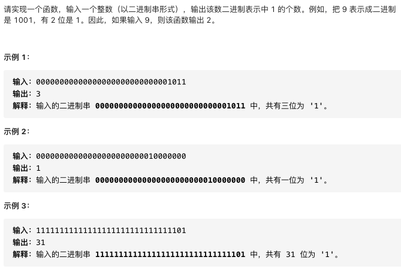
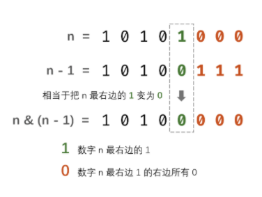

# 剑指offer15.二进制中1的个数

https://leetcode-cn.com/problems/er-jin-zhi-zhong-1de-ge-shu-lcof/


### 题目说明




### 解答

**思路**：

逐位统计，直到为0


### java >> 和 >>>的区别

1 表示右移，如果该数为正，则最高位补0，若为负数，则最高位补1

2 表示无符号右移，也叫逻辑右移，该数无论正负，最高位都是补0


### 方法1  逐位判断

时间复杂度 O(logn) 空间复杂度O(1) 相当对一个数每次除2

若n & 1 = 0，则n最右位为1

若n & 1 = 1，则n最右位为0

根据以上特点循环右移，直到n为0

```java
public class Solution {
    public int hammingWeight(int n) {
        int res = 0;
        while(n != 0) {
          // 最右位为1则加1，最右位为0则加0
            res += n & 1;
            n >>>= 1;
        }
        return res;
    }
}
```

### 方法2 使用n & (n - 1)

时间复杂度O(M) M为二进制n中1的个数

n & (n - 1) 二进制数字最右边的1变为0，其余不变



```java
public class Solution {
    public int hammingWeight(int n) {
        int res = 0;
        while(n != 0) {
            res++;
            n &= n - 1;
        }
        return res;
    }
}
```


