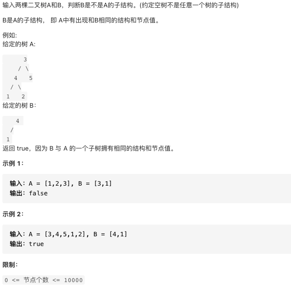

# 剑指offer26.树的子结构

https://leetcode-cn.com/problems/shu-de-zi-jie-gou-lcof/


### 题目说明




### 解答

**思路**：

1. 先序遍历A的每个节点nA；对应isSubStructure(A, B)
2. 判断树A中以nA为根节点的子树是否包含B；对应recur(A, B)

+ recur(A, B)函数
  + 当节点B为空：说明B已经匹配完成（越过叶节点），返回true
  + 当A为空，说明越过A叶节点，即匹配失败，返回false
  + 当AB值不同，匹配失败
+ isSubStructure(A, B)函数
  + 如果A或B为空直接返回，题意说明，空树不为子树
  + 否则检测B是否是以A为根本节点的子树

```java
class Solution {
    public boolean isSubStructure(TreeNode A, TreeNode B) {
        return (A != null && B != null) && (recur(A, B) || isSubStructure(A.left, B) || isSubStructure(A.right, B));
    }
    boolean recur(TreeNode A, TreeNode B) {
        if(B == null) return true;
        if(A == null || A.val != B.val) return false;
        return recur(A.left, B.left) && recur(A.right, B.right);
    }
}
```


