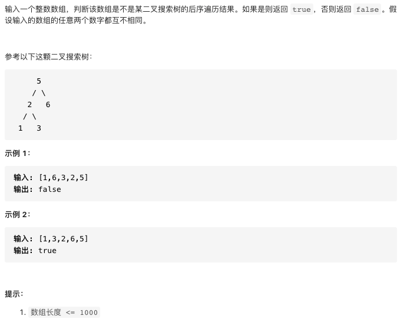

# 剑指offer33.二叉搜索树的后续遍历序列

https://leetcode-cn.com/problems/er-cha-sou-suo-shu-de-hou-xu-bian-li-xu-lie-lcof/


### 题目说明




### 解答

**思路**：

最后一个节点为根节点，遍历整个数组看是否符合二叉搜索树的定义，然后分治，检查子数组是否符合定义


### 方法1  递归分治

时间复杂度 O(n2) 空间复杂度O(n)

```java
class Solution {
  public boolean verifyPostorder(int[] postorder) {
    return recur(postorder, 0, postorder.length - 1);
  }
  // 函数判断 i到j的数组 是否满足二叉搜索树
  boolean recur(int[] postorder, int i, int j) {
    if(i >= j) return true;
    // 从i开始遍历，查看是否符合左子树的要求，即小于根节点
    int p = i;
    while(postorder[p] < postorder[j]) p++;
    // 保存左右子树的划分位置
    int m = p;
    while(postorder[p] > postorder[j]) p++;
    // 代表正确搜索到根节点位置
    // 刨除根节点，判断左右子树是否为二叉搜索树
    return p == j && recur(postorder, i, m - 1) && recur(postorder, m, j - 1);
  }
}
```


### 方法2 辅助单调栈（待补充）

时间复杂度O(n) 空间复杂度O(n)

