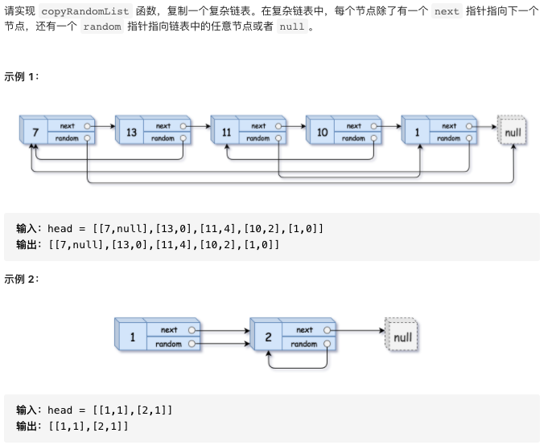

# 剑指offer35.复杂链表的复制

https://leetcode-cn.com/problems/fu-za-lian-biao-de-fu-zhi-lcof/


### 题目说明




### 解答

**思路**：

使用map建立新旧节点的映射，使用p指针开始遍历旧节点，如果能够在map中找到其新节点，则直接获得，否则创建新节点，同理给新节点的random和next指针赋值，注意不存在但为空的情况。最后p遍历下一个节点，直到为空。

### 方法1 

```java
/*
// Definition for a Node.
class Node {
    int val;
    Node next;
    Node random;

    public Node(int val) {
        this.val = val;
        this.next = null;
        this.random = null;
    }
}
*/
class Solution {
    public Node copyRandomList(Node head) {
        if(head == null) return null;
        // 使用map建立新旧节点的映射
        Map<Node, Node> map = new HashMap<>();
        // Node fake = head;
        // Node newFake = new Node(-1);
        // map.put(fake, newFake);
        Node p = head;
        while(p != null) {
            Node newP;
          // 检查该节点对应的新节点是否已经创建
            if(map.containsKey(p)) {
                newP = map.get(p);
            } else {
                newP = new Node(p.val);
                map.put(p, newP);
            }
            // 连接random指针
            if(map.containsKey(p.random)) {
                newP.random = map.get(p.random);
            } else {
              // 对应节点不存在
              // 对应节点为空
                if(p.random == null) {
                    newP.random = null;
                } else {
                  // 不为空创建新节点
                    Node temp = new Node(p.random.val);
                    newP.random = temp;
                }
                map.put(p.random, newP.random);
            }
            // 连接node指针
            if(map.containsKey(p.next)) {
                newP.next = map.get(p.next);
            } else {
                if(p.next == null) {
                    newP.next = null;
                } else {
                    Node temp = new Node(p.next.val);
                    newP.next = temp;
                }
                map.put(p.next, newP.next);
            }
            p = p.next;
        }
        return map.get(head);
    }
}
```


