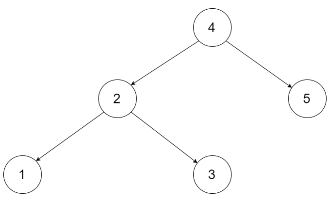
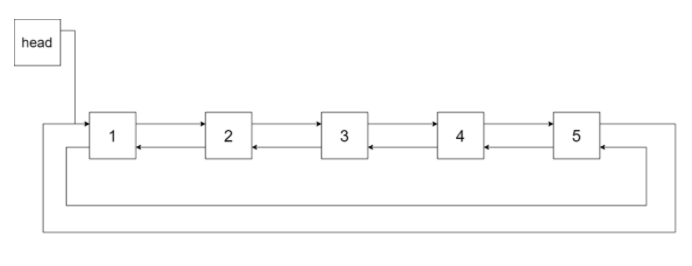

# 剑指offer36.二插搜索树与双向链表

https://leetcode-cn.com/problems/er-cha-sou-suo-shu-yu-shuang-xiang-lian-biao-lcof/


### 题目说明







### 解答

**思路**：

中序遍历的顺序即为链表的顺序


### 方法1 

设置当前节点cur，前驱节点pre，构建pre.right = cur 和 cur.left = pre

设置都头结点head和尾结点tail，遍历结束时pre的指向即为尾结点tail，第一次个遍历的到的节点即为头结点，此时pre为null。

```java
class Solution {
  Node pre, head;
  public Node treeToDoubleList(Node root) {
    if(root == null) return null;
    dfs(root);
    head.left = pre;
    pre.right = head;
    return head;
  }
  void dfs(Node cur) {
    if(cur == null) return;
    dfs(cur.left);
    if(pre != null) pre.right = cur;
    else head = cur;
    cur.left = pre;
    pre = cur;
    dfs(cur.right);
  }
}
```


