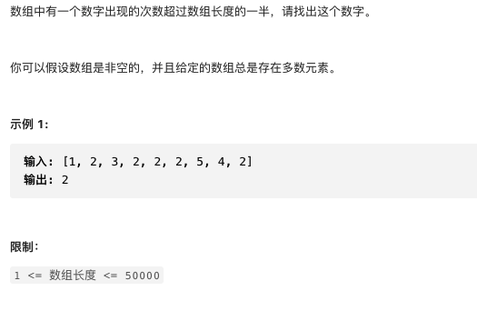

# 剑指offer39.数组中出现次数超过一半的数字

https://leetcode-cn.com/problems/shu-zu-zhong-chu-xian-ci-shu-chao-guo-yi-ban-de-shu-zi-lcof/solution/mian-shi-ti-39-shu-zu-zhong-chu-xian-ci-shu-chao-3/


### 题目说明




### 解答

**思路**：


### 方法1 哈希表统计法

时间复杂度 O(n) 空间复杂度O(n)

直接计数

### 方法2 摩尔投票法

时间复杂度O(n) 空间复杂度O(n)

推论1： 若记众数的票为+1，负数的票为-1，则一定有所有数字的票数和 > 0

推论2： 若前a个数的票数和为0，则剩余（n-a）个数字的票数和一定仍 > 0，即剩余的数众数仍为x

// 以推论二来逐渐减小集合，直到只剩众数

```java
class Solution {
  public int majorityElement(int[] nums) {
    int x = 0;
    int votes = 0;
    for(int num : nums) {
      if(votes == 0) x = num;
      votes += num == x ? 1 : -1;
    }
    return x;
  }
}
```


如果不存在众数，需要验证最后的x是否大于len / 2 

