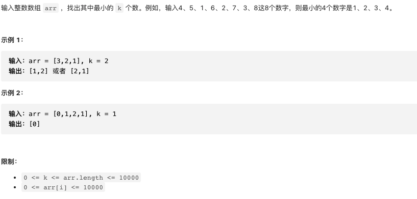

# 剑指offer40.最小的k个数

https://leetcode-cn.com/problems/zui-xiao-de-kge-shu-lcof/


### 题目说明




### 解答

**思路**：


### 方法1 快速排序思想

时间复杂度 O(n)最坏的情况为O(n2) 空间复杂度O(n)

```java
class Solution {
  public int[] getLeastNumbers(int[] arr, int k) {
    if(k >= arr.length) return arr;
    return quickSort(arr, k, 0, arr.length - 1);
  }
  private int[] quickSort(int[] arr, int k, int l, int r) {
    int i = l;
    int j = r;
    while(i < j) {
    while(i < j && arr[j] >= arr[l]) j--;
    while(i < j && arr[i] <= arr[l]) i++;
    swap(arr, i, j);
    }
  // 将哨兵交换到中间位置
  swap(arr, i, l);
  // 此时i前的i个数都是有序的 0 - i-1
  if(i > k) return quickSort(arr, k, l, i - 1);
  if(i < k) return quickSort(arr, k, i + 1, r);
  return Arrays.copyOf(arr, k);
	}
  private void swap(int[] arr, int i, int j) {
    int tmp = arr[i];
    arr[i] = arr[j];
    arr[j] = tmp;
  }
}

```


### 方法2 堆排序思想

时间复杂度O(nlogk) O(k)


### 方法3 直接排序

时间复杂度O(nlogn)

