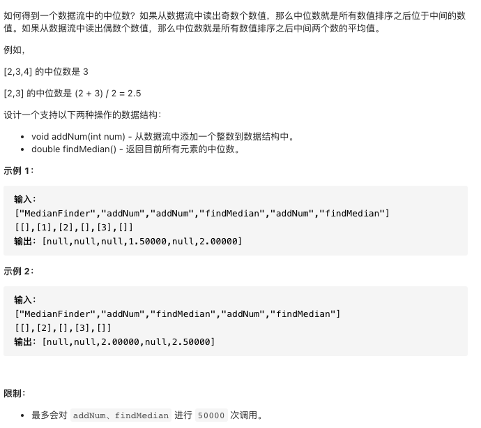

# 剑指offer41.数据流中的中位数

https://leetcode-cn.com/problems/shu-ju-liu-zhong-de-zhong-wei-shu-lcof/


### 题目说明



### 解答

**思路**：

普通思路：

二分查找插入位置O(logn)，移动元素O(n) 时间复杂度O(n)

使用堆将插入元素的时间复杂度降为O(logn)

#### **存储元素个数**

使用A、B两个堆，A为小顶堆，保存较大的部分，B为大顶堆，保存小的部分

当总个数为偶数时，AB相等，奇数时，A比B多1，即A>=B

#### 插入方式

偶数时，AB元素相同，插入A

奇数时，A元素多1，插入B

交叉插入，插入A时不确定元素大小，需要现将元素插入B，然后将B顶元素插入A。反之亦然

#### 中位数计算

偶数时，中位数为两个堆堆顶元素/2

奇数时，中位数为A堆顶元素


### 方法1 java优先队列

时间复杂度 O(logn) 空间复杂度O(n)

```java
class MedianFinder {

   Queue<Integer> A, B;
    /** initialize your data structure here. */
    public MedianFinder() {
        A = new PriorityQueue<>(); // 小顶堆 正序
        B = new PriorityQueue<>((x, y) -> (y - x)); // 大顶堆 逆序
    }

    public void addNum(int num) {
      
        if(A.size() != B.size()) {
            // 偶数插入A
            A.add(num);
            B.add(A.poll());
        } else {
            B.add(num);
            A.add(B.poll());
        }
    }
    public double findMedian() {
        if(A.size() != B.size())
            return A.peek();
        else return (A.peek() + B.peek()) / 2.0;
    }
}
```


