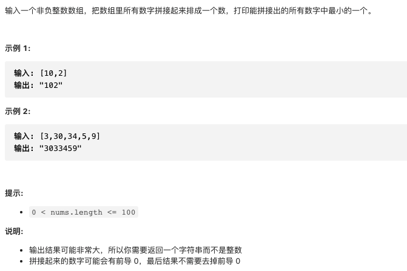

# 剑指offer45.把数组排列成最小的数

https://leetcode-cn.com/problems/ba-shu-zu-pai-cheng-zui-xiao-de-shu-lcof/


### 题目说明




### 解答

**思路**：

将字符串按从小到大排序，比较大小时，将带比较的两个字符串拼接和反向拼接，比较大小即可

### 方法1 

时间复杂度 O(nlogn) 排序的复杂度

```java
class Solution {
    public String minNumber(int[] nums) {
        String[] numS = new String[nums.length];
        for (int i = 0; i < numS.length; i++) {
            numS[i] = String.valueOf(nums[i]);
        }
        Arrays.sort(numS, (o1, o2) -> {
            String OT = o1 + o2;
            String TO = o2 + o1;
            return OT.compareTo(TO);
        });
        StringBuilder sb = new StringBuilder();
        for(String each : numS) {
            sb.append(each);
        }
        return sb.toString();
    }
}
```


