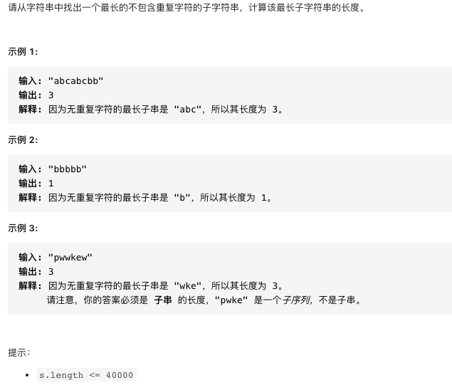

# 剑指offer48.最长不包含重复字符的子字符串

https://leetcode-cn.com/problems/zui-chang-bu-han-zhong-fu-zi-fu-de-zi-zi-fu-chuan-lcof/


### 题目说明




### 解答

**思路**：滑动窗口


### 方法1 双指针+哈希表

```java
public int lengthOfLongestSubstring(String s) {
        Set<Character> set = new HashSet<>();
        char[] str = s.toCharArray();
        int i = 0;
        int j = 0;
        int maxLen = Integer.MIN_VALUE;
        while(j < str.length) {
            while(j < str.length && !set.contains(str[j])) {
                set.add(str[j]);
                j++;
            }
            maxLen = Math.max(maxLen, j - i);
            if(j >= str.length) break;
            while(set.contains(str[j])) {
                set.remove(str[i]);
                i++;
            }
        }
        return maxLen;
    }
```


