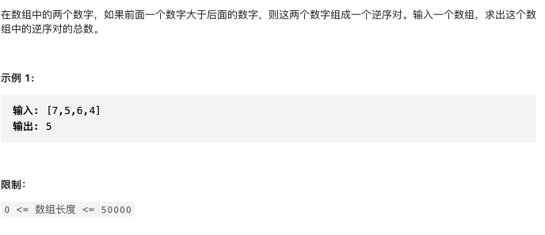
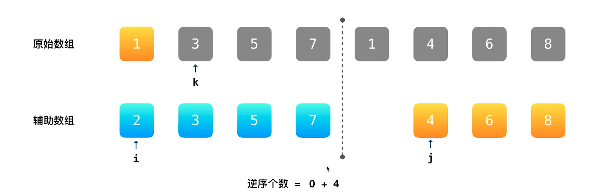

# 剑指offer51.数组中的逆序对

https://leetcode-cn.com/problems/shu-zu-zhong-de-ni-xu-dui-lcof/


### 题目说明




### 解答

**思路**：

分治思想

递归求解子问题，然后合并



利用部分有序的特性，当1放入原始数组时，此时逆序对的个数应该加上1之前未并入元素的个数

部分有序的数组的逆序对，在归并时已经计算过了

### 方法1 

时间复杂度 O(nlogn) 空间复杂度O(n)

```java
public class Solution {
  public int reversePairs(int[] nums) {
    int len = nums.length;
    // 1 或 0时构不成数对
    if(len < 2) {
      return 0;
    }
    // 创建临时数组，用于暂存原数组
    int[] temp = new int[len];
    // 计算[0, len - 1]数组范围的逆序对
    return reversePairs(nums, 0, len - 1, temp);
  }
  private int reversePairs(int[] nums, int left, int right, int[] temp) {
    // 递归结束条件
    if(left == right) return 0;
    // 将当前数组划分为相同大小的两部分，分别计算两部分，然后在合并
    int mid = left + (right - left) / 2;
    int leftPairs = reversePairs(nums, left, mid, temp);
    int rightPairs = reversePairs(nums, mid + 1, right, temp);
    
    // 完全有序时，返回结果
    if(nums[mid] <= nums[mid + 1]) {
      return leftPairs + rightPairs;
    }
    
    // 非完全有序，合并左右部分，并计算逆序对个数
    int crossPairs = mergeAndCount(nums, left, mid, right, temp);
    return leftPairs + rightPairs + crossPairs;
  }
  // 合并两部分，并计算逆序对
  private int mergeAndCount(int[] nums, int left, int mid, int right, int[] temp) {
    // 首先复制对应位置元素，然后归并到原数组
    for(int i = left; i <= right; i++) {
      temp[i] = nums[i];
    }
    int i = left;
    int j = mid + 1;
    int count = 0;
    for(int k = left; k <= right; k++) {
      // i到达边界，证明左部分合并完成，只需处理右半部分
      if(i == mid + 1) {
        nums[k] = temp[j];
        j++;
      } else if(j == right + 1) {
        nums[k] = temp[i];
        i++;
      } else if(temp[i] <= temp[j]) {
        nums[k] = temp[i];
        i++;
      } else {
        nums[k] = temp[j];
        j++;
        // 合并右半部分数据时，左半部分剩余的元素个数，就是右半部分能够构成逆序对的个数
        count += (mid - i + 1);
      }
    }
    return count;
  }
}
```


