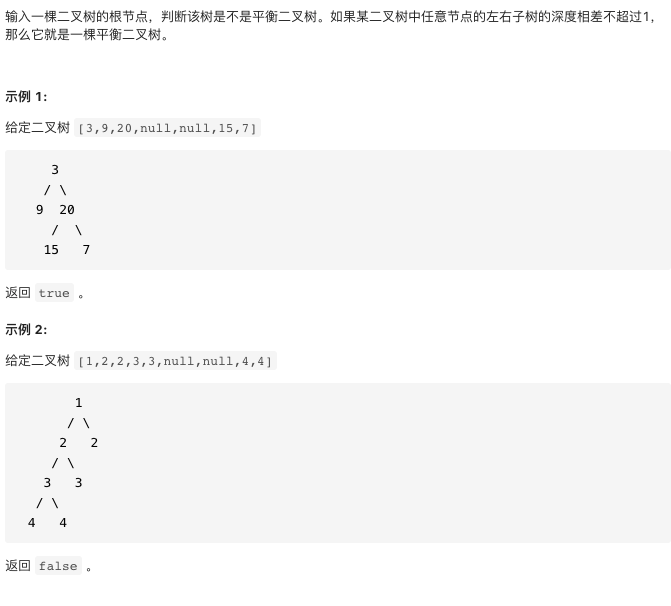

# 剑指offer55-II.平衡二叉树

https://leetcode-cn.com/problems/ping-heng-er-cha-shu-lcof/


### 题目说明




### 解答

**思路**：

将判断是否平衡二叉树和计算节点深度同时进行，不是平衡二叉树返回-1，否则返回深度


### 方法1 

时间复杂度 O(n) 空间复杂度O(n) 最差情况

```java
class Solution {
  public boolean isBalanced(TreeNode root) {
    return recur(root) != -1;
  }
  private int recur(TreeNode root) {
    if(root == null) return 0;
    int left = recur(root.left);
    if(left == -1) return -1;
    int right = recur(root.right);
    if(right == - 1) return -1;
    return Math.abs(left - right) < 2 ? Math.max(left, right) + 1 : -1;
  }
}
```


### 方法2 存在大量重复计算

O(nlog)

```java
class Solution {
    public boolean isBalanced(TreeNode root) {
        if(root == null) return true;
        return isBalanced(root.left) && isBalanced(root.right) && (Math.abs(height(root.left) - height(root.right)) <= 1);
    }
    private int height(TreeNode root) {
        if(root == null) return 0;
        int left = height(root.left);
        int right = height(root.right);
        return Math.max(left, right) + 1;
    }
}
```

