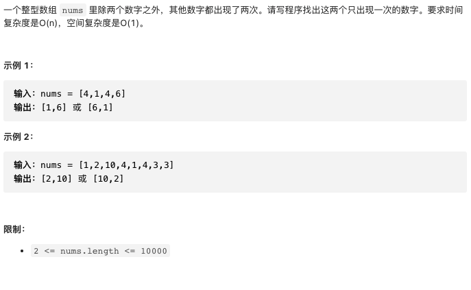

# 剑指offer56-I.数组中数字出现的次数

https://leetcode-cn.com/problems/shu-zu-zhong-shu-zi-chu-xian-de-ci-shu-lcof/


### 题目说明




### 解答

**思路**：

全部数据异或，剩余两个不同元素的异或值。找到两个元素第一个不相同的位，按此位分组，组内异或，最后剩余的数即为答案。

### 方法1 分组异或

时间复杂度 O(n) 空间复杂度O(1)

```java
class Solution {
    public int[] singleNumbers(int[] nums) {
        int ret = 0;
        // 得到两个数的异或值
        for (int n : nums) {
            ret ^= n;
        }
        int div = 1;
        // 找到第一个不相等的位 1^0 = 1
        while ((div & ret) == 0) {
            div <<= 1;
        }
        int a = 0, b = 0;
        // 按照此位置分组，相同的元素一定在同一组异或抵消，最后a为一个元素，b为一个元素
        for (int n : nums) {
            if ((div & n) != 0) {
                a ^= n;
            } else {
                b ^= n;
            }
        }
        return new int[]{a, b};
    }
}
```


