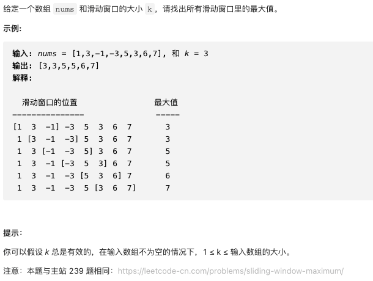

# 剑指offer59-I.滑动窗口的最大值

https://leetcode-cn.com/problems/hua-dong-chuang-kou-de-zui-da-zhi-lcof/


### 题目说明




### 解答

**思路**：

使用一个单调队列，跟随滑动窗口一起遍历，队列始终保持递减。

结果长度为 nums.length - (k + 1)，1为步长

### 方法1 单调队列

j从0开始，i从1-k开始，始终包含k个数。i == 1时开始移除第一个元素，i >= 0时开始更新最大值

```java
class Solution
  public int[] maxSlidingWindow(int[] nums, int k) {
  if(nums.length == 0 || k == 0) return new int[0];
  Deque<Integer> deque = new LinkedList<>();
  // 结果长度 为 n - k + 步长
  int[] res = new int[nums.length - k + 1];
  for(int j = 0, i = 1 - k; j < nums.length; j++, i++) {
    // 如果移除的元素为最大值，删除deque中对应的元素
    if(i > 0 && deque.peekFirst == nums[i - 1]) deque.removeFirst();
    // 保持deque递减，移除所有小于 nums[j] 的元素
    while(!deque.isEmpty() && deque.peekLast() < nums[j])
      deque.removeLast();
    deque.addLast(nums[j]);
    // 得到一个结果，记录窗口最大值
    if(i >= 0)
      res[i] = deque.peekFirst();
  }
  return res;
}
```


