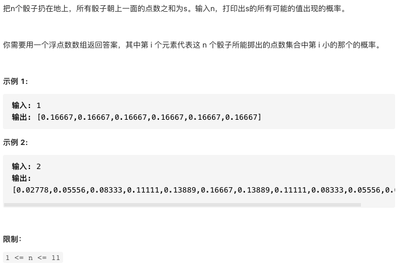
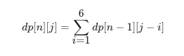

# 剑指offer60.n个骰子的点数

https://leetcode-cn.com/problems/nge-tou-zi-de-dian-shu-lcof/


### 题目说明




### 解答

**思路**：

动态规划

dp i,j表示投掷i次骰子，点数为j的次数  可以由此计算，第n次投出的点数为i

骰子的总情况为6*n次方

点数范围分布在i -- 6 * i


### 方法1 动态规划

```java
public double[] dicesProbability(int n) {
        // 投掷i次色子，点数j的出现次数
        int[][] dp = new int[n + 1][6 * n + 1];
        for(int i = 1; i <= 6; i++) {
            dp[1][i] = 1;
        }
        for(int i = 2; i <= n; i++) {
            for(int j = i; j <= 6 * i; j++) {
                // 第n次状态由第n-1次转义而来
                for(int cur = 1; cur <= 6; cur++) {
                    if(j - cur <= 0) break;
                    dp[i][j] += dp[i - 1][j - cur];
                }
            }
        }
        // 计算总次数
        double all = Math.pow(6, n);
        double[] res = new double[6 * n - n + 1];
        int k = 0;
        for(int i = n; i <= 6 * n; i++) {
            res[k++] = dp[n][i] * 1.0 / all;
        }
        return res;
    }
```

### 方法2 优化空间

```java
public double[] dicesProbability(int n) {
        // 投掷i次色子，点数j的出现次数
        int[] dp = new int[6 * n + 1];
        for(int i = 1; i <= 6; i++) {
            dp[i] = 1;
        }
        for(int i = 2; i <= n; i++) {
          // 这里要从大到小计算，否则会覆盖i-1次的结果
            for(int j = 6 * i; j >= i; j--) {
                // 注意这里，需要初始化为0
                dp[j] = 0;
                for(int cur = 1; cur <= 6; cur++) {
                  // 范围发生了变化，合法的范围每次随i右移 第二次从转移1-6 第三次只能从2-12
                    if(j - cur < i - 1) break;
                    dp[j] += dp[j - cur];
                }
            }
        }
        // 计算总次数
        double all = Math.pow(6, n);
        double[] res = new double[6 * n - n + 1];
        int k = 0;
        for(int i = n; i <= 6 * n; i++) {
            res[k++] = dp[i] * 1.0 / all;
        }
        return res;
    }
```


