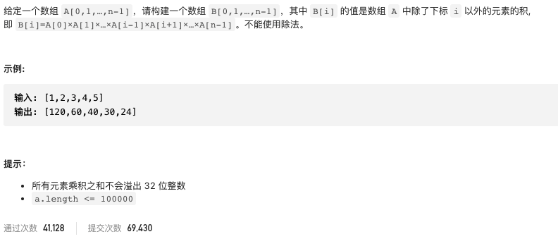
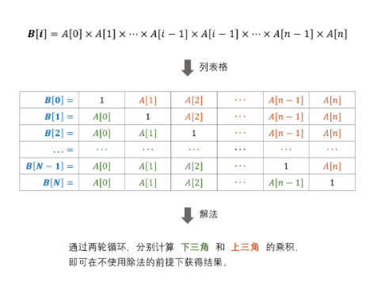
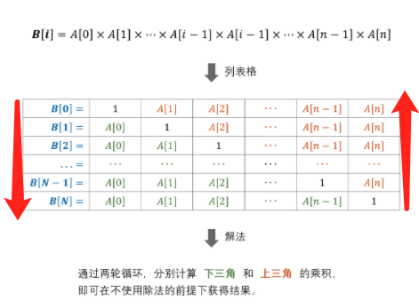

# 剑指offer66.构建乘积数组

https://leetcode-cn.com/problems/gou-jian-cheng-ji-shu-zu-lcof/


### 题目说明




### 解答

**思路**：

动态规划

表格对角线置为1，分别迭代计算上下部分的乘积

初始化结果数组b，b[0] = 1，辅助变量tmp = 1 由b[0]计算b[1] 只需b[0] * a[0] 递推方程b[i] = b[i - 1] * a[i - 1]






### 方法1 

时间复杂度 O(n) 空间复杂度O(1)

```java
class Solution {
    public int[] constructArr(int[] a) {
        if(a.length == 0) return new int[0];
        int[] b = new int[a.length];
        b[0] = 1;
        int tmp = 1;
      //由上往下计算，暂存到b
        for(int i = 1; i < a.length; i++) {
            b[i] = b[i - 1] * a[i - 1];
        }
      // 由下往上计算，存入tmp，然后与已有的b 计算得到结果
        for(int i = a.length - 2; i >= 0; i--) {
            tmp *= a[i + 1];
            b[i] *= tmp;
        }
        return b;
    }
}

```