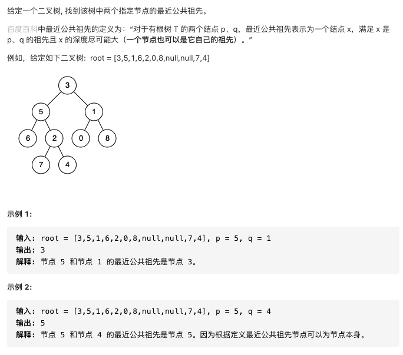

# 剑指offer68.二叉树的最近公共祖先

二叉搜索树

https://leetcode-cn.com/problems/er-cha-sou-suo-shu-de-zui-jin-gong-gong-zu-xian-lcof/submissions/

二叉树

https://leetcode-cn.com/problems/er-cha-shu-de-zui-jin-gong-gong-zu-xian-lcof/


### 题目说明




### 解答

**思路**：

后序遍历，第一个满足条件的节点，即为最近公共祖先

条件：左右子树均包含pq节点或左子树右子树包含pq本身节点为pq

### 方法1 

时间复杂度 O(n) 空间复杂度O(n)

```java
class Solution {
    TreeNode ans;
    public TreeNode lowestCommonAncestor(TreeNode root, TreeNode p, TreeNode q) {
        dfs(root, p, q);
        return ans;
    }
    // 确定root的左右子树是否包含p或q
  // 满足条件则给答案赋值
    public boolean dfs(TreeNode root, TreeNode p, TreeNode q) {
        if(root == null) return false;
        boolean lson = dfs(root.left, p, q);
        boolean rson = dfs(root.right, p, q);
        // 判断是否是公共祖先
        // 左右子树均包含pq，或者左子树右子树包含pq，本身节点等于pq
        if ((lson && rson) || ((lson || rson) && (root.val == p.val || root.val == q.val))) {
            ans = root;
        }
        return lson || rson || root.val == p.val || root.val == q.val;

    }
}
```

### 方法2 二叉搜索树

时间复杂度O(n) 空间复杂度O(1)

一次遍历

当前节点大于pq值则向左遍历

当前节点小于pq值向右遍历

一大一小代表找到公共祖先

```java
class Solution {
    public TreeNode lowestCommonAncestor(TreeNode root, TreeNode p, TreeNode q) {
        TreeNode ancestor = root;
        while (true) {
            if (p.val < ancestor.val && q.val < ancestor.val) {
                ancestor = ancestor.left;
            } else if (p.val > ancestor.val && q.val > ancestor.val) {
                ancestor = ancestor.right;
            } else {
                break;
            }
        }
        return ancestor;
    }
}
```


